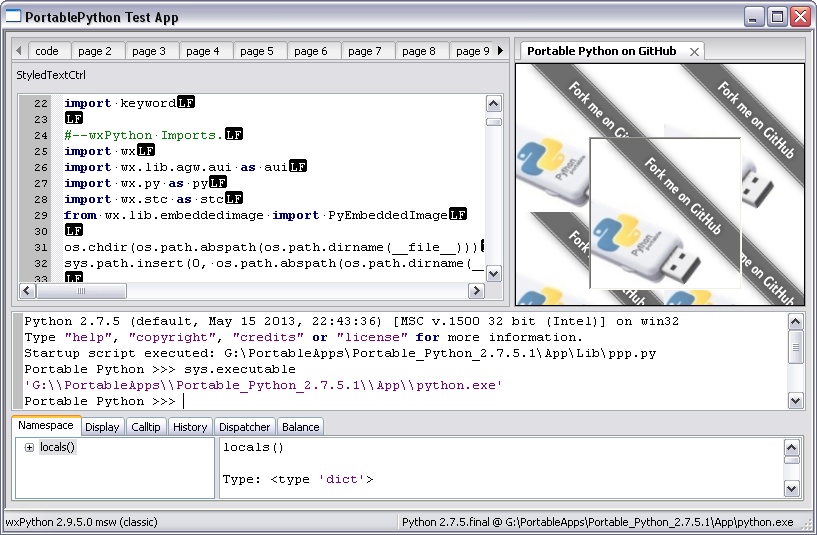

=====================
Portable Python tests
=====================

Tests for various packages, etc... included in portable python.
Each package should have at least 1 sanity test/smoke app doing something with
the package to make sure "your not going down in flames :(" when you actually
try to run something portably.
Preferably ones that run on PY2 & PY3 if at all possible.

Ex: wxPython "phoenix" is PY2/PY3, but wxPython "classic" is only PY2.
The cross-compatability can most likely be accomplished for most packages
portable tests without uglifying the code too much with a library such as six.
If 2 tests are needed; one for PY2 and one for PY3,
place which python version at the end of the test app/script filename such as
`pp_testpackagename_py2.py`
or
`pp_testpackagename_py3.py`.

This is the **portable shebang** you should be using:
* `#!/usr/bin/env python`

Sanity tests and to show things are actually working right for said item.

These are meant to be run with portable python. Yes, the portable one, not
one you might happen to have installed locally.

Example run: P as in portable thumbdrive letter...
* P:\Portable_Python\Python-Portable.exe "pathto\tests\pp_wxPython.py"

Task List
---------
- [ ] PyScripter
- [ ] PyCharm Community Edition
- [ ] NymPy
- [ ] SciPy
- [ ] Matplotlib
- [ ] PyWin32
- [ ] Django
- [ ] PIL/Pillow
- [ ] Py2Exe
- [x] wxPython
- [ ] NetworkX
- [ ] Lxml
- [ ] PySerial
- [ ] PyODBC
- [ ] PyGame
- [ ] PyGTK
- [ ] PyQt
- [ ] IPython
- [ ] Pandas
- [ ] Dateutil
- [ ] PyParsing
- [x] Six
- [ ] XLRD
- [ ] XLWT
- [ ] XLUtils
- [ ] OpenPyXL
